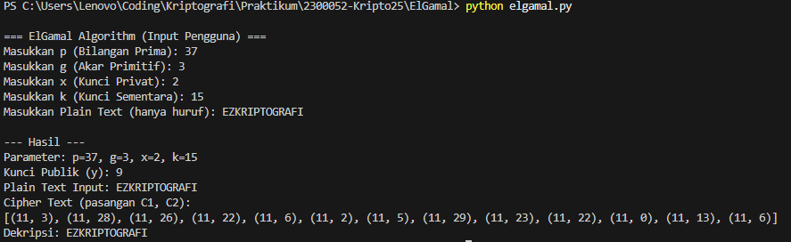

# ElGamal Algorithm Implementation (Python)

## 📁 Deskripsi
Program ini mengimplementasikan algoritma ElGamal, sebuah sistem kriptografi kunci publik (Asimetris) yang memanfaatkan kesulitan dalam memecahkan masalah Logaritma Diskret. Algoritma ini sering digunakan untuk pertukaran kunci dan enkripsi data.

## ⚙️ Penjelasan Alur Program

### 1. Key Generation (Pra-Enkripsi)
1.  **Input:** Pengguna memasukkan parameter utama: Bilangan Prima ($p$), Akar Primitif ($g$), dan Kunci Privat ($x$).
2.  **Kunci Publik ($y$):** Dihitung menggunakan rumus: $y = g^x \pmod{p}$.

### 2. Enkripsi
1.  **Input:** Plain Text (PT) dan Kunci Sementara ($k$) dipilih.
2.  **Plain Text to Angka:** Karakter PT dikonversi ke nilai numerik $M$ (A=0, Z=25).
3.  **Hitung $C_1$ (Kunci Ephemeral):** $C_1 = g^k \pmod{p}$.
4.  **Hitung $C_2$ (Enkripsi Data):** $C_2 = M \cdot y^k \pmod{p}$.
5.  **Output:** Cipher Text berupa pasangan nilai $(C_1, C_2)$ untuk setiap karakter.

### 3. Dekripsi
1.  **Input:** Cipher Text $(C_1, C_2)$, Bilangan Prima ($p$), dan Kunci Privat ($x$).
2.  **Hitung Invers Kunci:** Dihitung nilai $(C_1^x)^{-1} \pmod{p}$. Ini adalah invers perkalian modular dari $C_1$ yang dipangkatkan dengan Kunci Privat $x$.
3.  **Perhitungan:** Untuk setiap pasangan $(C_1, C_2)$, dilakukan perhitungan.
    * **Rumus Dekripsi:** $M = C_2 \cdot (C_1^x)^{-1} \pmod{p}$
4.  **Output:** Nilai $M$ dikonversi kembali menjadi karakter Plain Text (PT).

## 🚀 Cara Menjalankan Program

1.  Pastikan Python terinstal.
2.  Buka terminal/command prompt.
3.  Arahkan ke direktori `ElGamal`.
4.  Jalankan file Python:
    ```bash
    python elgamal.py
    ```
5.  Masukkan parameter $p, g, x, k$ dan Plain Text sesuai prompt. (Gunakan nilai $p$ yang cukup besar untuk keamanan, atau nilai contoh seperti $p=37$ untuk pengujian).

## 🖼️ Screenshoot Running Program
