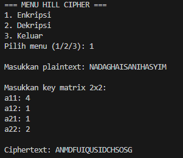
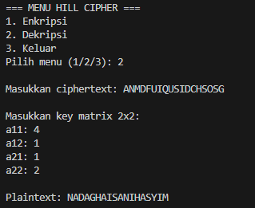
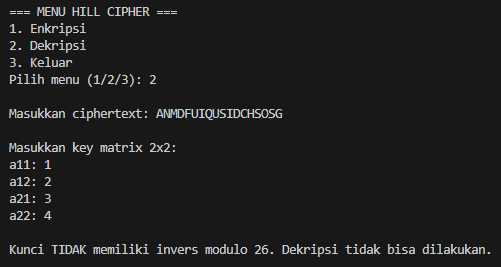
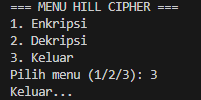

# Program Hill Cipher 

Program ini digunakan untuk melakukan enkripsi dan dekripsi menggunakan Hill Cipher
dengan ukuran matriks kunci 2x2.

## Alur Program

1. Program menampilkan menu:
   - 1: Enkripsi
   - 2: Dekripsi
   - 3: Keluar

2. Jika memilih Enkripsi:
   - User memasukkan plaintext.
   - User memasukkan key matrix 2x2.
   - Program mengubah huruf menjadi angka (A=0 … Z=25).
   - Program melakukan operasi matriks (Key × Plain) mod 26.
   - Program menampilkan ciphertext.

3. Jika memilih Dekripsi:
   - User memasukkan ciphertext.
   - User memasukkan key matrix.
   - Program menghitung determinan dan inverse modulo 26.
   - Program melakukan operasi matriks (InvKey × Cipher) mod 26.
   - Program menampilkan plaintext.

## Screenshot Program

