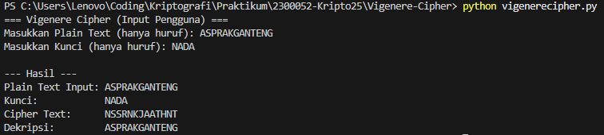

# Vigenere Cipher Implementation (Python)

## 📁 Deskripsi
Program ini mengimplementasikan algoritma Vigenere Cipher, yang merupakan salah satu metode kriptografi klasik berbasis substitusi polialfabetik. Algoritma ini menggunakan kunci berulang untuk menggeser huruf pada Plain Text, sehingga menghasilkan Cipher Text.

## ⚙️ Penjelasan Alur Program

### 1. Enkripsi
1.  **Input:** Pengguna memasukkan Plain Text (PT) dan Kunci.
2.  **Normalisasi:** PT dan Kunci diubah menjadi huruf kapital dan spasi dihilangkan.
3.  **Iterasi:** Program mengulang (iterasi) melalui setiap karakter PT.
4.  **Kunci Berulang:** Kunci diulang (modulus panjang kunci) agar sesuai dengan panjang PT.
5.  **Perhitungan:** Untuk setiap huruf, dilakukan perhitungan nilai numerik (A=0, Z=25).
    * **Rumus Enkripsi:** $E = (PT_{val} + Kunci_{val}) \pmod{26}$
6.  **Output:** Hasil perhitungan dikonversi kembali menjadi karakter (Cipher Text).

### 2. Dekripsi
1.  **Input:** Cipher Text (CT) dan Kunci.
2.  **Iterasi & Kunci Berulang:** Sama seperti enkripsi, kunci diulang.
3.  **Perhitungan:** Untuk mengembalikan ke PT, dilakukan operasi kebalikan.
    * **Rumus Dekripsi:** $D = (CT_{val} - Kunci_{val} + 26) \pmod{26}$
4.  **Output:** Hasil dikonversi kembali menjadi Plain Text (PT).

## 🚀 Cara Menjalankan Program

1.  Pastikan Anda memiliki Python terinstal.
2.  Buka terminal/command prompt.
3.  Arahkan ke direktori `Vigenere-Cipher`.
4.  Jalankan file Python:
    ```bash
    python vigenerecipher.py
    ```
5.  Masukkan Plain Text dan Kunci sesuai prompt.

## 🖼️ Screenshoot Running Program
